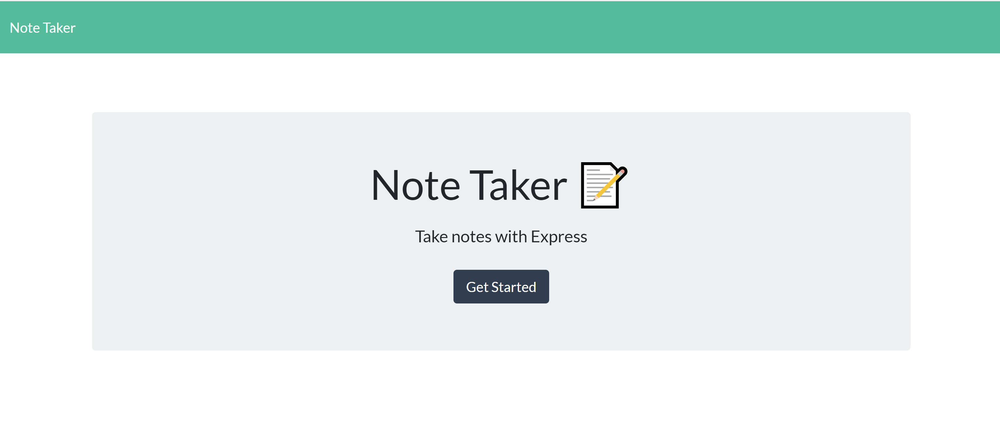
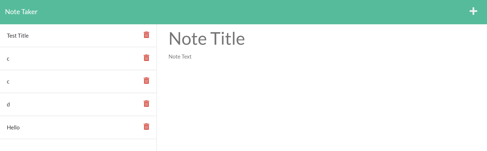

# Note-Taker
A simple Note Taking page to write and save notes

## Description
This application uses Express.js to save and retrieve note data from a JSON file.

[Google Drive Link](https://drive.google.com/file/d/1Z6z9eI2U09t_VIfcruKSLYAO2d3wMhps/view)

Heroku deployed link: https://lit-thicket-12723.herokuapp.com

## Installation
The user must install the Express npm package and run: node server.js
